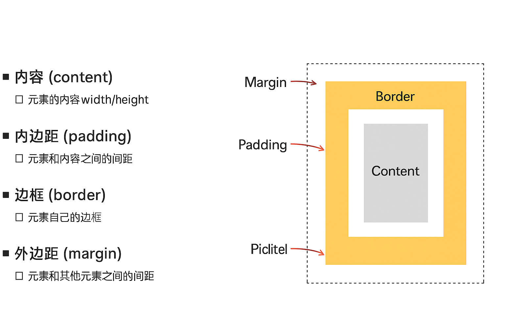

# 盒子

## CSS 属性特性

### CSS 属性的继承

CSS 某些属性具有继承性

- 如果一个属性具备继承,那么在该元素设置后,他的后代都可以继承这个属性
- 如果后代元素自己有设置该手续,那么有限使用后代自己的属性,不管继承过来的属性权重有多高

### 示例

```html
<!DOCTYPE html>
<html lang="en">
  <head>
    <meta charset="UTF-8" />
    <title>继承示例</title>
    <style>
      .parent {
        color: blue; /* 父元素设置字体颜色 */
      }

      .child1 {
        /* 没有设置 color，会继承自父元素 */
      }

      .child2 {
        color: red; /* 自己设置了 color，覆盖继承 */
      }
    </style>
  </head>
  <body>
    <div class="parent">
      <p class="child1">这是继承的文字（蓝色）</p>
      <p class="child2">这是自己设置的文字（红色）</p>
    </div>
  </body>
</html>
```

#### 如何知道一个属性具有继承性

1. **看官方文档（如 MDN）**  
   在每个属性文档中，都会写明 `是否可继承（Inherited: yes/no）`

2. **经验法则：跟“文本和字体相关”的属性大多可继承**

   - 因为这些属性控制的是视觉一致性（比如一段文字的颜色、字体、大小）

3. **也可以手动让任何属性继承：**
   ```css
   div {
     border: inherit; /* 显式让子元素继承 border */
   }
   ```

#### 哪些属性具有继承性

| 分类     | 常见继承属性                                                                                                                         |
| -------- | ------------------------------------------------------------------------------------------------------------------------------------ |
| **字体** | `font`, `font-family`, `font-size`, `font-style`, `font-variant`, `font-weight`                                                      |
| **文本** | `color`, `letter-spacing`, `line-height`, `word-spacing`, `text-align`, `text-indent`, `text-transform`, `visibility`, `white-space` |
| **表格** | `border-collapse`, `caption-side`, `empty-cells`                                                                                     |
| **列表** | `list-style`, `list-style-type`, `list-style-position`, `list-style-image`                                                           |
| **其他** | `direction`, `quotes`                                                                                                                |

> [!tip]
> 上方只是描述了一部分继承性属性,具体查看文档

### CSS 属性的层叠

#### 什么是层叠

- 同一个元素的**同一个属性**，可以被多个规则设置。
- 浏览器会按一定规则“**层层比较**”，最终只选择一个样式生效。
- 这个选择过程就叫**层叠（Cascading）**。

### ✅ 层叠的表现：

- **多个选择器**作用于同一个元素
- **多个样式来源**（浏览器默认、外部样式、内联样式、`!important`）
- **多个位置**写了同一属性（如 `color`）

最终：

> [!tip] > **只有一个值会生效，其他的会被覆盖。**

#### 示例

```html
<style>
  p {
    color: blue;
  }

  .highlight {
    color: red;
  }
</style>

<p class="highlight">这段文字是什么颜色？</p>
```

- `<p>` 元素同时被标签选择器和类选择器匹配

- 类选择器 .highlight 的优先级更高

- 所以最终 color: red; 生效

> [!tip]
> !important 的使用和影响
> 样式来源优先级（内联 > 外部 > 默认）
> 选择器优先级（specificity）
> 当权重相等由 CSS 设置的样式顺序决定

### CSS 属性的类型

在 HTML/CSS 中，不同元素根据默认的 `display` 属性可以分为两类：**块级元素（block）** 和 **行内元素（inline）**。

#### ✅ 1. 块级元素（Block Elements）

- 占据整行（独占父元素一行）
- 可以设置 `width`、`height`
- 可以设置 `margin` 和 `padding`
- 默认垂直排列

#### ✅ 2. 行内元素（Inline Elements）

- 只占据内容本身的宽度

- 不会换行

- 不能设置宽高

- 默认水平排列

#### ✅ 3. 行内替换元素 （特殊元素）

- 行内表现：它们通常是 行内元素，也就是说，它们的默认行为是不会换行的，并且在同一行内显示其他元素（除非没有足够空间）。
- 替换内容：它们的内容通常由外部资源替代。例如，`` 被图像文件替代，`<input>` 被表单控件替代。
- 可以设置宽度和高度：尽管它们是行内元素，但由于它们的内容来自外部资源，所以它们可以设置 宽度（width） 和 高度（height）。

### display

| `display` 值    | 含义                 | 特点                                 |
| --------------- | -------------------- | ------------------------------------ |
| `block`         | 块级元素             | 独占一行，可设置 `width` 和 `height` |
| `inline`        | 行内元素             | 不换行，不能设置宽高                 |
| `inline-block`  | 行内显示但可设置宽高 | 兼具 `inline` 和 `block` 的特性      |
| `none`          | 不显示               | 元素从页面移除，不占用任何空间       |
| `flex` / `grid` | 弹性布局 / 网格布局  | 用于布局容器，适合创建响应式结构     |

### 元素隐藏

HTML 元素可以通过多种方式隐藏，但它们的**原理和效果是不同的**。以下是最常用的 4 种隐藏方法：

---

| 方法                                    | 是否占空间    | 可否被访问（点击/复制） | 是否参与渲染      | 适用场景                     |
| --------------------------------------- | ------------- | ----------------------- | ----------------- | ---------------------------- |
| `display: none;`                        | ❌ 不占空间   | ❌ 无法访问             | ❌ 不参与         | 完全隐藏、条件渲染           |
| `visibility: hidden;`                   | ✅ 占空间     | ❌ 无法访问             | ✅ 仍然渲染       | 需要保留布局但隐藏元素       |
| `opacity: 0;`                           | ✅ 占空间     | ✅ 可以访问（会点到）   | ✅ 仍然渲染       | 视觉透明、保留事件响应       |
| `position: absolute` + `left: -9999px;` | ❌ 视觉上移除 | ✅ 可访问（屏幕外）     | ✅ 渲染但移出视口 | SEO 隐藏、辅助文本（无障碍） |

---

### CSS 样式不生效的原因

- 选择器优先级
- 选择器没选中对应的元素
- CSS 属性使用的形式不对: 例如: 元素不支持此 CSS,浏览器不支持此 CSS 属性，被同类型的 CSS 属性覆盖
- 属性拼写错误/值不合法
- 缓存
- 样式被 JS 动态修改覆盖
- 忘记保存文件 / 没刷新页面 😅

### overflow

`overflow` 用于控制当元素内容**超出元素尺寸（如宽度或高度）**时，应该如何显示。

---

#### ✅ 常见取值

| 属性值    | 说明                                     |
| --------- | ---------------------------------------- |
| `visible` | 默认值，**内容不会被裁剪**，可能溢出容器 |
| `hidden`  | **超出部分被裁剪**，不可见               |
| `scroll`  | **始终显示滚动条**，无论是否超出内容     |
| `auto`    | **内容超出时自动添加滚动条**             |

## CSS 盒子模型

每个 HTML 元素在浏览器中都被渲染为一个矩形盒子，包含以下几部分：

---

### ✅ 盒模型组成：

| 部分              | 含义                                    |
| ----------------- | --------------------------------------- |
| 内容（content）   | 元素的内容区域，控制宽高 `width/height` |
| 内边距（padding） | 内容与边框之间的**间距**，填充背景色    |
| 边框（border）    | 元素的边框，环绕在 padding 外层         |
| 外边距（margin）  | 元素与其他元素之间的**外部间距**        |

---

### 📌 图示说明：



### 🔍 注意事项：

- `padding` 和 `border` 会**影响盒子大小**
- `margin` 可以合并（垂直方向）
- 可使用 `box-sizing` 控制尺寸计算方式：

```css
/* 不包含 padding 和 border（默认） */
box-sizing: content-box;

/* 包含 padding 和 border，推荐使用 */
box-sizing: border-box;
```

### 示例

```html
<!DOCTYPE html>
<html lang="en">
  <head>
    <meta charset="UTF-8" />
    <title>Content 区域示例</title>
    <style>
      .box {
        width: 200px;
        height: 100px;
        background-color: lightblue;
        border: 2px solid blue;
        padding: 20px;
        margin: 30px;
      }
    </style>
  </head>
  <body>
    <div class="box">Content 区域大小为 200 × 100</div>
  </body>
</html>
```

### 认识盒子模型

### 内容 width/height

#### min-width & min-height: 最小宽度 & 高度

无论内容多少,宽度都大于或等于 min-width

#### max-width & max-height: 最大宽度 & 高度

无论内容多少,宽度都小于等于 max-width

#### auto
width: auto 和 height: auto 使得元素的宽度和高度会自动适应它的内容。

##### auto & 100% 区别
- auto：表示元素的宽度或高度 自动根据内容 来确定。它依赖于元素的内容、父容器的尺寸和其他样式来决定元素的实际尺寸。

- 100%：表示元素的宽度或高度 等于其父元素的宽度或高度的 100%。换句话说，元素的尺寸会完全填满其父容器的尺寸。
> [!tip]
> 移动端适配时,可以设置最小宽度和高度

### 内容区
内容区是盒子模型的中心，它呈现了盒子的主要信息内容，这些内容可以是文本、图片等多种类型。
元素中的所有子元素和文本内容都在内容区中。
```css
.box1 {
  width: 100px;
  height: 100px;
  background-color: #bfa;
}
```


### 内边距 padding


### 边框/圆角 border

### 外边距 margin

### 盒子和文字阴影


### 外边距折叠问题

####


### box-sizing
