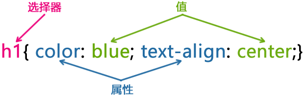

# CSS 入门

## CSS 基本概述

CSS，全称 **Cascading Style Sheets**，即“层叠样式表”，是用于控制网页外观样式的语言。

> [!tip]
> 理解“层叠”:**当多个样式作用在同一个元素上时，浏览器会按照一定规则决定哪个样式生效。**,通俗易懂的描述就是套娃,将样式一层一层套到标签

## CSS 的作用

- 设置网页的颜色、字体、大小、布局、背景、动画等视觉样式
- HTML 结构和样式分离。提升可维护性

## CSS 解决了什么问题

### 在没有 CSS 之前：

- 所有网页只能靠 HTML 标签简单控制样式（例如 `<font>` 标签）
- 样式杂乱、代码冗余、难以统一管理

### 有了 CSS 之后：

- **统一样式**：整个网站的字体、颜色只需改一处
- **结构和表现分离**：HTML 只关注内容结构，CSS 负责展示
- **可扩展性强**：通过类名或选择器快速批量改样式

## ⚠️ CSS 的难点在哪？

1. **层叠（Cascading）规则复杂**

   - 不同选择器的优先级（Specificity）
   - 后写的样式会覆盖前面的（但也取决于来源）

2. **布局系统抽象**

   - 传统布局（如 `float`, `inline-block`）不直观
   - 现代布局（如 Flexbox, Grid）更强大但需要理解其模型

3. **兼容性问题**

   - 各个浏览器对 CSS 特性支持程度不同，需要测试适配

4. **响应式设计**

   - 页面需要根据不同屏幕尺寸适配，涉及媒体查询、弹性布局等

5. **样式冲突与命名混乱**
   - 多个样式文件交叉使用时，可能出现覆盖、冲突

## CSS 语法规则



## CSS 样式如何应用到元素上

- 内联样式[inline style]
- 内部样式表
- 外部样式表

### 疑问

开发中具体使用哪种方式.

> [!tip]
> 开发中三种都会用到,不同的方式有不同的场景。

### 内联样式

内联样式存在 HTML 元素的 `style` 属性中，HTML 中每个元素都可以使用内联样式。

#### 示例

::: code-group

```inline-html.html [html]
<!DOCTYPE html>
<html lang="en">
<head>
    <meta charset="UTF-8">
    <meta name="viewport" content="width=device-width, initial-scale=1.0">
    <title>Document</title>
</head>
<body>
    <div style="color:red">hello world</div>
</body>
</html>
```

:::

#### 缺点

> [!warning]
> 缺点:
>
> - 样式过多时,不可读
> - 与结构耦合紧密
> - 权重过高，可能导致样式冲突: 内联样式的权重比外部样式表高，可能导致样式覆盖失效，调试困难。

特殊场景有特殊作用,这里表示的是内联是具有一些缺点,根据场景进行选择

### 内部样式

内部样式写在 HTML 的 `<head>` 区域，通过 `<style>`...`</style>` 包裹。

::: code-group

```internal-html.html [html]
<!DOCTYPE html>
<html lang="en">
<head>
    <meta charset="UTF-8">
    <meta name="viewport" content="width=device-width, initial-scale=1.0">
    <title>Document</title>
    <style>
        div{
            color: red;
            font-size: 20px;
        }
    </style>
</head>
<body>
    <div style="color:red">hello world</div>
</body>
</html>
```

:::

#### 缺点

> [!warning]
> 缺点:
>
> - 只能作用于当前页面，不利于多页面复用
> - 页面变大，结构和样式仍然混在一起
> - 不适合大型项目维护

### 外部样式

将 CSS 写在单独的 .css 文件中，再通过 <link> 标签引入到 HTML 页面中。

::: code-group

```extenal-html.html [html]
<!DOCTYPE html>
<html lang="en">
<head>
  <meta charset="UTF-8">
  <link rel="stylesheet" href="style.css">
</head>
<body>
  <div class="hello">hello world</div>
</body>
</html>
```

```style.css [css]
.hello {
  color: red;
  font-size: 20px;
}

```

:::

#### 优点

> [!tip]
> ✅ 推荐做法（尤其是中大型项目）
>
> - 样式与结构分离，清晰明了
> - 可以被多个页面复用，提升开发效率
> - 文件体积小、可缓存、利于性能优化
> - 更容易维护、协作开发

### 推荐

- ✅ 外部样式：用于正式开发，多页面复用样式。
- ✅ 内部样式：用于单页项目。
- ✅ 内联样式：用于**快速测试**


## CSS 样式注释

在 CSS 中，使用 `/* 注释内容 */` 的格式进行注释。 主要面向开发者理解你写的代码作用

---

### 示例：

```css
/* 这是一个注释 */
body {
  background-color: #f0f0f0; /* 设置背景颜色 */
}

/* 设置主要按钮样式 */
.button {
  padding: 10px;
  color: white;
  background: blue;
}
```

## 常见 CSS 元素分类
- 基本 CSS 属性
- 定位 & 布局
- 展示 & 可见性
- 盒模型
- 颜色 & 背景
- 字体 & 文本
- 选择器
- 动画与过渡
- 响应式设计
- 其他

## CSS 官方文档


### 🌐 1. [MDN Web Docs (强烈推荐)](https://developer.mozilla.org/zh-CN/docs/Web/CSS)

- 内容丰富、例子清晰、语法标准
- 提供中文和英文版本
- 覆盖所有 CSS 属性、选择器、函数、媒体查询等

> [!TIP]
> - [CSS 主页](https://developer.mozilla.org/zh-CN/docs/Web/CSS)
> - [color 属性](https://developer.mozilla.org/zh-CN/docs/Web/CSS/color)


### 📘 2. [W3C 官方文档（规范原文）](https://www.w3.org/Style/CSS/Overview.en.html)

- CSS 语言的标准规范制定机构
- 偏技术，适合深入阅读规范文档
- 内容较晦涩，不适合初学者日常查阅


### 📊 3. [Can I use（CSS 兼容性查询）](https://caniuse.com/)

- 查询 CSS 特性在各大浏览器中的**兼容性支持情况**
- 常用于判断是否能在生产环境中安全使用某些新属性
- 示例用途：
  - `display: grid` 是否支持 IE？
  - `backdrop-filter` 哪些浏览器可用？


