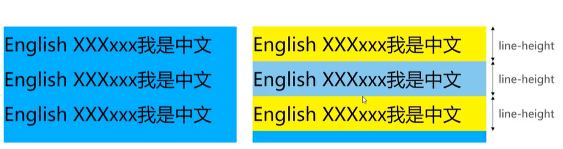
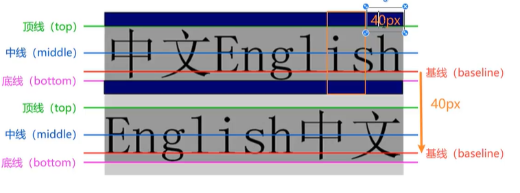

# CSS 文本 & 字体

## text-transform

用于设置文字的**大小写格式**。

### text-transform 值

- `capitalize`：每个单词**首字母大写**
- `uppercase`：全部转换为大写字母
- `lowercase`：全部转换为小写字母
- `none`：无转换，保留原始格式

### 示例：

```css
p {
  text-transform: uppercase;
}
```

## text-indent

用于设置段落首行的缩进距离。

### 示例:

```
p {
  text-indent: 2em;
}
```

### 作用

> [!tip]
> 💡 常用于中文排版，让段落更有阅读感。

## text-align

用于设置文本在其容器内的对齐方式。如何相对于它的块父元素对齐

### 可选值

- left（默认）：左对齐

- right：右对齐

- center：居中对齐

- justify：两端对齐

### 示例

```
<!DOCTYPE html>
<html lang="en">
<head>
    <meta charset="UTF-8">
    <meta name="viewport" content="width=device-width, initial-scale=1.0">
    <title>Document</title>
    <style>
     .div_container{
        width: 100px;
        height: 100px;
        background-color: red;
     }
     .div_container p {
         text-align: right;
     }
    </style>
</head>
<body>
    <div class="div_container">
        <p>Test hello</p>
    </div>
</body>
</html>
```

> [!warning]
> text-align 不仅仅局限于文本,还可以适用于图片(行内元素),行内级元素.

## word/letter-spacing

用于控制单词之间或字母之间的空隙。

1. word-spacing — 单词间距
   css

```
p {
  word-spacing: 10px;
}
```

> [!warning]
> 只适用于英文

2. letter-spacing — 字符间距

```css
p {
  letter-spacing: 2px;
}
```

> [!tip] 效果：每个字母之间拉开间距。

## text-decoration

## `text-decoration` — 文本装饰线

`text-decoration` 用于给文字添加下划线、删除线、波浪线等视觉效果，也可移除默认装饰（如超链接的下划线）。

---

### ✅ 常见取值：

| 值             | 说明             | 示例效果      |
| -------------- | ---------------- | ------------- |
| `none`         | 无装饰           | 🚫 移除下划线 |
| `underline`    | 下划线           | abc̲           |
| `overline`     | 上划线           | ̅abc           |
| `line-through` | 删除线（中划线） | a̶b̶c̶           |
| `blink`        | 闪烁（已废弃）   | ❌ 不建议使用 |

---

### ✅ 示例：

```css
a {
  text-decoration: none;
}
```

### 组合

可以同时设置线类型、颜色、样式等：

```css
p {
  text-decoration: underline dotted red;
}
```

同等于

```css
text-decoration-line: underline;
text-decoration-style: dotted;
text-decoration-color: red;
```

## font-family

用于设置文本使用的字体。

```css
p {
  font-family: "Arial", sans-serif;
}
```

- 通常写多个字体名，前面的没加载到就使用后面的

- 建议加一个通用字体族（如：sans-serif）

## font-weight

制字体的“加粗”程度。

```css
p {
  font-weight: bold;
}
/* 或者数值方式 */
p {
  font-weight: 400; /* 正常 */
  font-weight: 700; /* 加粗 */
}
```

- 常用值：normal、bold、lighter、bolder

- 数字值范围：100 ~ 900

## line-height: 非常重要

控制文字行与行之间的距离。两行文字基线之间的间距



```css
<!DOCTYPE html>
<html lang="en">
<head>
  <meta charset="UTF-8" />
  <meta name="viewport" content="width=device-width, initial-scale=1.0"/>
  <title>Line-height 示例</title>
  <style>
    .div_container {
      width: 200px;
      height: auto;
      background-color: #f0f0f0;
      padding: 10px;
    }

    .normal {
      line-height: normal; /* 默认值 */
      background-color: lightyellow;
    }

    .tall {
      line-height: 50px;
      background-color: lightblue;
    }

    p {
      margin: 0;
    }
  </style>
</head>
<body>
  <div class="div_container">
    <p class="normal">这是第一行文字。<br/>这是第二行。</p>
    <hr />
    <p class="tall">这是第一行文字。<br/>这是第二行。</p>
  </div>
</body>
</html>

```

### 为什么设置 line-height 就能让文本垂直居中？

line-height - font-size = 上 + 下的总空隙,这两边的“空隙”是平均分布在文字上方和下方

#### 举例说明

举例说明

```
span {
  font-size: 16px;
  line-height: 40px;
}
```

文本高度是 16px

行高是 40px

多出来的 40 - 16 = 24px 空间

上面 12px，下面 12px —— 平分


## font

一次性设置多个字体相关属性。

```
p {
  font: italic small-caps bold 16px/1.5 "Arial", sans-serif;
}
```

- font-style：字体样式（如 italic）

- font-variant：小型大写字母（如 small-caps）

- font-weight：字体粗细

- font-size（必须写）

- line-height（可选，用 / 分隔）

- font-family（必须写）

## font-style: 不重要

设置字体的斜体

## font-varint: 不重要

影响小写字母的显示

## 额外小知识

### font-size 的大小单位

#### 📊 font-size 单位对比表

| 单位  | 类型     | 相对对象                 | 示例值             | 实际效果（以 16px 为参考） | 适用场景                     |
| ----- | -------- | ------------------------ | ------------------ | -------------------------- | ---------------------------- |
| `px`  | 绝对单位 | 无（固定数值）           | `font-size: 16px;` | 精确为 16 像素             | 精准设计稿还原，常规网页文字 |
| `em`  | 相对单位 | 当前元素的父字体大小     | `1.5em`            | 父元素大小 × 1.5           | 局部缩放，按钮/图标文字等    |
| `rem` | 相对单位 | 根元素（html）的字体大小 | `1.25rem`          | 根字体大小 × 1.25          | 响应式设计、统一字体控制     |
| `%`   | 相对单位 | 父元素字体大小           | `120%`             | 父大小 × 1.2               | 继承样式，自适应文字         |

#### 📐 font-size 单位说明对比表

| 单位  | 示例代码                                                            | 实际效果                        | 特点说明                         |
| ----- | ------------------------------------------------------------------- | ------------------------------- | -------------------------------- |
| `px`  | `css<br>p { font-size: 20px; }<br>`                                 | 固定为 20 像素                  | 固定大小，不随父级或屏幕缩放变化 |
| `em`  | `css<br>p { font-size: 1.5em; }<br>`                                | 父元素为 16px → 1.5 × 16 = 24px | 相对父级字体，嵌套时会累加变大   |
| `rem` | `css<br>html { font-size: 16px; }<br>p { font-size: 1.25rem; }<br>` | 根为 16px → 1.25 × 16 = 20px    | 相对根元素，推荐用于响应式设计   |
| `%`   | `css<br>div { font-size: 120%; }<br>`                               | 父为 16px → 120% = 19.2px       | 相对父级，适用于继承式样式调整   |
