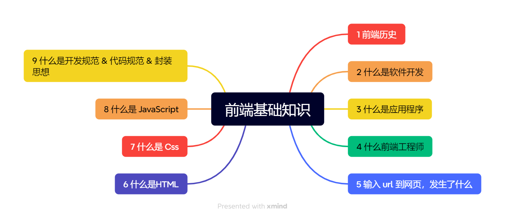
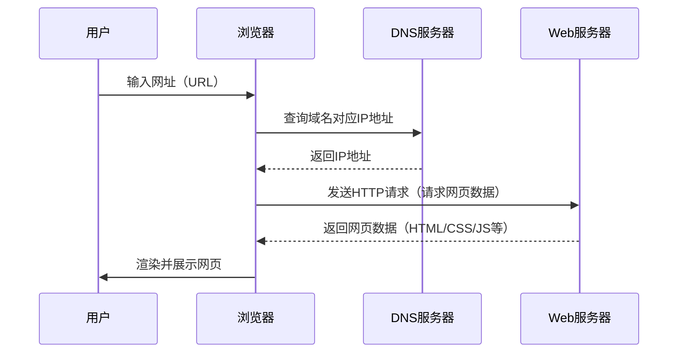
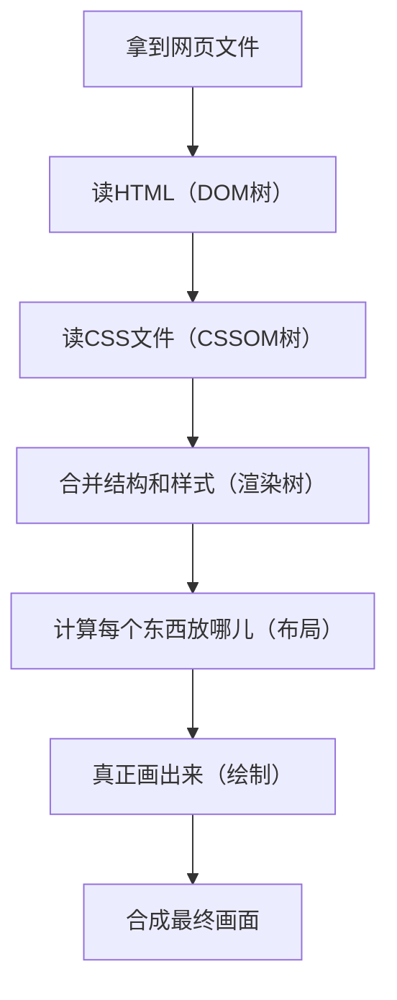

# 前端基础知识

## 路线

## 前端历史 ⏳

::: timeline 1990-1994
### 洪荒时代
- 1990：Tim Berners-Lee 发明第一个 Web 浏览器
- 前端技术以静态页面为主，内容由后台服务生成
- 1993：CGI 诞生，为动态页面生成提供基础
:::

::: timeline 1994-1999
### 浏览器战争
- 1994：网景发布 Navigator
- 微软推出 IE
- 1995：JavaScript 诞生，前端开始具备交互能力
:::

::: timeline 2005-2009
### Ajax 与局部刷新
- Ajax 技术流行，实现页面局部刷新，提升用户体验
:::

::: timeline 2009-2012
### jQuery 时代
- 2006：jQuery 发布，极大简化了 DOM 操作，成为前端开发标配
:::

::: timeline 2012-2016
### 工程化与模块化
- jQuery 逐渐被模块化、工程化思想取代，前端开发进入新阶段
:::

::: timeline 2016-至今
### 框架三国鼎立
- React、Vue、Angular 三大框架割据，推动前端生态繁荣
:::

::: timeline 2017-至今
### 跨平台与小程序
- 微信、支付宝等小程序技术兴起，前端开发者可轻松开发跨平台应用
:::

::: tip
本时间线为简要梳理，详细内容请查阅相关文档。
:::

## 什么是软件开发
软件开发是指通过分析需求、设计、编码、测试和维护等过程，开发出能够解决实际问题或满足用户需求的软件系统。

**生活中的例子：**

- 就像装修房子一样，软件开发也需要先有设计图（需求分析和设计），然后由工人（程序员）按照图纸一步步施工（编码），最后还要验收和维护（测试和运维）。
- 比如你用的微信、支付宝、外卖App，这些应用都是软件开发团队根据用户需求“设计—开发—测试—上线—维护”一步步做出来的。
- 再比如做饭：先确定要做什么菜（需求），准备食材（设计和准备），按照菜谱烹饪（编码实现），最后品尝和调整味道（测试和维护）。

## 什么是应用程序
应用程序（Application）是指为用户完成某种特定任务而开发的软件。它通过一系列按照顺序组织的计算机数据和指令

## 什么是前端工程师
前端工程师是负责网站 & 应用程序 & APP & 小程序等界面开发的技术人员,是用户接触和使用软件的第一入口。

## 输入 url 到网页，发生了什么
### 简单流程

## 什么是 HTML

HTML（超文本标记语言，HyperText Markup Language）是构建网页内容的基础语言。它通过标签（如 `<h1>`、`
`、`<a>` 等）来描述网页的结构和内容，比如标题、段落、图片、链接等。所有网页的骨架都是由 HTML 构建的。

**生活中的例子：**
- 就像盖房子时搭建的框架，HTML 就是网页的“骨架”，决定了页面上有哪些内容和结构。

## 什么是 CSS

CSS（层叠样式表，Cascading Style Sheets）是一种用来为网页添加样式的语言。它可以控制 HTML 元素的颜色、字体、布局、间距、动画等，让网页变得美观和有层次感。

**生活中的例子：**
- 如果把 HTML 比作房子的骨架，CSS 就像给房子刷墙、贴瓷砖、挂窗帘，让房子变得漂亮、舒适、有风格。

## 什么是 JavaScript

JavaScript 是一种运行在浏览器中的脚本语言，用于实现网页的动态效果和交互功能。比如表单校验、轮播图、弹窗、数据交互等，都是通过 JavaScript 实现的。

**生活中的例子：**
- 如果把 HTML 比作房子的骨架，JavaScript 就像房子里的电路和开关，让房子“动”起来，比如开灯、关门等。

## 什么是前后端分离

## 为什么需要前后端分离

## 浏览器的作用以及内核
浏览器的作用是负责将前端的文件进行一个解析和渲染网页内容，是用户与前端的桥梁

### 浏览器内核是什么？

浏览器内核（Rendering Engine）是浏览器的核心组件，主要负责网页的解析、渲染和交互。它包括两大部分：

- **渲染引擎（Rendering Engine）**：负责解析 HTML、CSS，生成页面内容并渲染到屏幕上。
- **JS 引擎（JavaScript Engine）**：负责解析和执行 JavaScript 脚本，实现网页的动态交互。

不同浏览器可能采用不同的内核，内核的不同会导致网页在不同浏览器下的表现略有差异。

### 主流浏览器内核对比表
下方是我从浏览器进行收集的引擎信息

| 浏览器         | 渲染引擎（排版引擎） | JS 引擎         | 备注                         |
|----------------|----------------------|------------------|------------------------------|
| Chrome         | Blink                | V8               | Blink 基于 WebKit 分支        |
| Edge（新版）   | Blink                | V8               | Chromium 内核                |
| Edge（旧版）   | EdgeHTML             | Chakra           | 现已被新版 Edge 替代         |
| Safari         | WebKit               | JavaScriptCore   | 苹果自研，iOS/iPadOS专用      |
| Firefox        | Gecko                | SpiderMonkey     | 独立开发                     |
| Opera（新）    | Blink                | V8               | 早期用 Presto，现用 Blink    |
| 360/QQ/UC等国产浏览器 | Blink/WebKit/Trident | V8/JSCore/Chakra | 多内核，兼容模式切换         |
| Internet Explorer | Trident           | Chakra           | 已停止维护                   |

**说明：**
- Blink 是 Google 主导开发的渲染引擎，现已成为主流（Chrome、Edge、Opera 等）。
- WebKit 是 Safari 和早期 Chrome 的内核，iOS 上所有浏览器都必须用 WebKit。
- Gecko 是 Firefox 独有的内核。
- Trident 是 IE 的内核，已被淘汰。
- JS 引擎决定了 JavaScript 的执行效率和特性支持。

### 浏览器渲染基本流程

1. 拿到网页文件

浏览器先从服务器拿到网页的 HTML 文件。

2. 读网页内容，搭积木

浏览器像搭积木一样，把 HTML 里的标签变成一个个没有颜色的积木,然后组合成 “结构树”（DOM树）。

3. 读样式，给积木上色

浏览器再去读 CSS 文件，把每个积木（网页元素）该是什么颜色、大小、字体都记下来（CSSOM树）。

4. 合并结构和样式，准备画画

把结构[积木]和样式[颜色]合起来，决定哪些东西要显示、怎么显示（渲染树）。

5. 计算每个东西放哪儿

浏览器算一算，每个元素应该放在页面的哪个位置、占多大地方（布局/回流）

6. 真正画出来

浏览器把这些内容一块块画到屏幕上（绘制）。

7. 合成最终画面

如果有动画、浮层等，浏览器会把不同的“画布”合成，最后显示给你看。

##### 流程图

## 前端多领域开发技术方案

| 领域 | 主要应用场景 | 技术方案 | 代表框架/工具 | 学习资源 |
|------|--------------|----------|---------------|----------|
| **Web应用** | 企业官网、信息展示页 | 基础三件套 | HTML5, CSS3, JavaScript | [MDN Web文档](https://developer.mozilla.org/zh-CN/) |
|  | 后台管理系统 | 前端框架 | Vue.js, React, Angular | [Vue Admin模板](https://github.com/PanJiaChen/vue-element-admin) |
|  | 移动端H5 | 响应式设计 | Flex布局, Grid布局, REM单位 | [响应式设计指南](https://developer.mozilla.org/zh-CN/docs/Learn/CSS/CSS_layout/Responsive_Design) |
| **小程序** | 微信/支付宝小程序 | 小程序框架 | Taro, uni-app, 原生开发 | [uni-app文档](https://uniapp.dcloud.net.cn/) |
|  | 跨平台小程序 | 多端统一方案 | uni-app, Taro | [Taro文档](https://taro-docs.jd.com/docs/) |
| **移动应用** | 原生体验应用 | React Native | React Native + 原生模块 | [React Native文档](https://reactnative.dev/) |
|  | 跨平台应用 | 混合开发 | uni-app, Flutter, Ionic | [uni-app移动端](https://uniapp.dcloud.net.cn/tutorial/platform.html) |
| **桌面应用** | Windows/macOS应用 | Electron | Electron + 前端框架 | [Electron文档](https://www.electronjs.org/) |
|  | 轻量级桌面应用 | Web技术封装 | Tauri, NW.js | [Tauri文档](https://tauri.app/) |
| **服务端** | API服务 | Node.js运行时 | Express, Koa, NestJS | [Express指南](https://expressjs.com/) |
|  | 全栈开发 | 服务端渲染 | Next.js (React), Nuxt.js (Vue) | [Next.js文档](https://nextjs.org/docs) |
|  | 数据库操作 | ORM工具 | TypeORM, Sequelize | [TypeORM指南](https://typeorm.io/#/) |

## 什么是开发规范 & 代码规范 & 封装思想

- **开发规范**：指团队或项目在开发过程中约定的一系列流程、标准和最佳实践，比如文件命名、目录结构、代码提交流程等，目的是让开发更高效、协作更顺畅。
- **代码规范**：指代码书写时需要遵循的格式和风格要求，比如缩进、变量命名、注释、函数长度等，目的是让代码更易读、易维护、易协作。
- **封装思想**：是一种面向对象编程思想，把相关的数据和功能组织在一起，隐藏内部实现细节，只暴露必要的接口，提升代码的复用性和安全性。

**生活中的例子：**
- 开发规范和代码规范就像工厂的生产标准，保证每个人生产出来的零件都能顺利组装在一起。
- 封装思想就像家电的遥控器，你只需要按按钮就能操作，不需要关心内部电路是怎么工作的。
