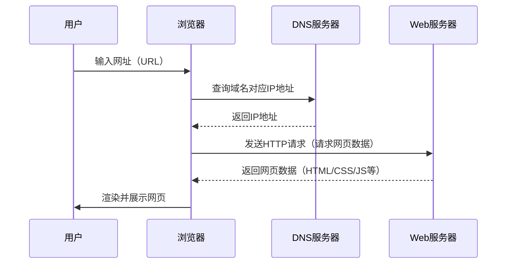
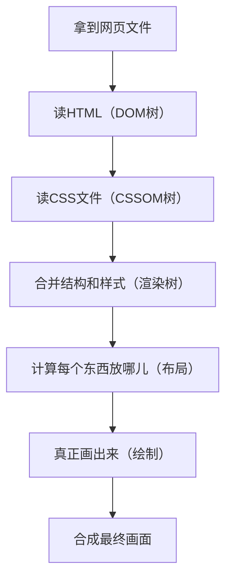

# 前端基础知识


## 路线


## 前端历史 ⏳

::: timeline 1990-1994
### 洪荒时代
- 1990：Tim Berners-Lee 发明第一个 Web 浏览器
- 前端技术以静态页面为主，内容由后台服务生成
- 1993：CGI 诞生，为动态页面生成提供基础
:::

::: timeline 1994-1999
### 浏览器战争
- 1994：网景发布 Navigator
- 微软推出 IE
- 1995：JavaScript 诞生，前端开始具备交互能力
:::

::: timeline 2005-2009
### Ajax 与局部刷新
- Ajax 技术流行，实现页面局部刷新，提升用户体验
:::

::: timeline 2009-2012
### jQuery 时代
- 2006：jQuery 发布，极大简化了 DOM 操作，成为前端开发标配
:::

::: timeline 2012-2016
### 工程化与模块化
- jQuery 逐渐被模块化、工程化思想取代，前端开发进入新阶段
:::

::: timeline 2016-至今
### 框架三国鼎立
- React、Vue、Angular 三大框架割据，推动前端生态繁荣
:::

::: timeline 2017-至今
### 跨平台与小程序
- 微信、支付宝等小程序技术兴起，前端开发者可轻松开发跨平台应用
:::

::: tip
本时间线为简要梳理，详细内容请查阅相关文档。
:::


## 什么是软件开发
软件开发是指通过分析需求、设计、编码、测试和维护等过程，开发出能够解决实际问题或满足用户需求的软件系统。

**生活中的例子：**

- 就像装修房子一样，软件开发也需要先有设计图（需求分析和设计），然后由工人（程序员）按照图纸一步步施工（编码），最后还要验收和维护（测试和运维）。
- 比如你用的微信、支付宝、外卖App，这些应用都是软件开发团队根据用户需求“设计—开发—测试—上线—维护”一步步做出来的。
- 再比如做饭：先确定要做什么菜（需求），准备食材（设计和准备），按照菜谱烹饪（编码实现），最后品尝和调整味道（测试和维护）。


## 什么是应用程序
应用程序（Application）是指为用户完成某种特定任务而开发的软件。它通过一系列按照顺序组织的计算机数据和指令


## 什么是前端工程师
前端工程师是负责网站 & 应用程序 & APP & 小程序等界面开发的技术人员,是用户接触和使用软件的第一入口。


## 输入 url 到网页，发生了什么
### 简单流程


## 什么是 HTML

HTML（超文本标记语言，HyperText Markup Language）是构建网页内容的基础语言。它通过标签（如 `<h1>`、`<p>`、`<a>` 等）来描述网页的结构和内容，比如标题、段落、图片、链接等。所有网页的骨架都是由 HTML 构建的。

**生活中的例子：**
- 就像盖房子时搭建的框架，HTML 就是网页的“骨架”，决定了页面上有哪些内容和结构。


## 什么是 CSS

CSS（层叠样式表，Cascading Style Sheets）是一种用来为网页添加样式的语言。它可以控制 HTML 元素的颜色、字体、布局、间距、动画等，让网页变得美观和有层次感。

**生活中的例子**
- 如果把 HTML 比作房子的骨架，CSS 就像给房子刷墙、贴瓷砖、挂窗帘，让房子变得漂亮、舒适、有风格。

## 什么是 JavaScript

JavaScript 是一种运行在浏览器中的脚本语言，用于实现网页的动态效果和交互功能。比如表单校验、轮播图、弹窗、数据交互等，都是通过 JavaScript 实现的。

** 生活中的例子**
- 如果把 HTML 比作房子的骨架，JavaScript 就像房子里的电路和开关，让房子“动”起来，比如开灯、关门等。

## 什么是前后端分离


## 为什么需要前后端分离

## 什么是服务器

## 字符编码
### 1. 文字是如何存储到机器中的？
当我们在计算机上输入一个文字（比如字母、数字或者符号），计算机会通过 **字符编码** 将这个文字转换成机器能理解的二进制数据。这个过程就像是把我们平常看到的字母（比如 "A"）转换成计算机能够处理的数字。

例如，在 **ASCII** 编码中，字母 "A" 对应的数字是 **65**。计算机内部会将这个数字转换成二进制表示，例如：

- "A" -> ASCII 编码值 **65** -> 二进制 **01000001**

这个过程叫做 **编码**，即将文字转换为数字，计算机通过这些数字来存储和处理文字。

### 2. 计算机怎么从机器中读取并显示文字？
当计算机需要显示文字时，它会从内存或存储中读取这些二进制数据，然后使用 **字符编码表** 将数字转换回字符。例如，如果计算机读取到数字 **65**，它会查找字符编码表，发现 **65** 对应的是字母 **"A"**，然后将 **"A"** 显示在屏幕上。

### 3. 如果使用了不同的编码会发生什么？
假设我们在存储文本时使用了一种编码，而在读取时却用另一种编码来解码。这就会导致 **字符解码错误**，显示成乱码，原因是不同编码中的数字代表的字符不同。

#### 示例 1：存储时用 UTF-8，读取时用 ASCII
- 存储：我们输入一个中文字符 "我"，它在 UTF-8 编码下是多个字节存储的，例如：
  - "我" 的 UTF-8 编码是 **E6 88 91**（三个字节）。
- 读取：如果计算机以 **ASCII** 编码方式去读取这些字节，ASCII 只能处理 128 个字符（主要是英文和符号），它会把 **E6**、**88** 和 **91** 看作独立的字节，但 ASCII 表并没有定义这些字节对应的字符，于是会出现乱码。

比如，"我" 在 UTF-8 编码下被存储成 **E6 88 91**，但在 ASCII 解码时，这些字节会变成一些奇怪的符号，显示出来可能会是一些不可识别的乱码。

#### 示例 2：存储时用 UTF-16，读取时用 UTF-8
- 存储：如果我们存储一个字符 "A"，它在 **UTF-16** 编码下可能是 **00 41**（占用 2 字节）。
- 读取：但如果我们用 **UTF-8** 去解码这两个字节，它会把 **00 41** 解释成两个独立的字符，结果就不是 "A" 了，而是乱码。

### 4. 不同编码格式导致的乱码问题
每种编码方式（如 **UTF-8**、**ASCII**、**ISO-8859-1** 等）有自己的一套字符表。例如：

- 在 **UTF-8** 编码中，"A" 的编码是 **0x41**。
- 在 **ISO-8859-1** 编码中，"A" 也是 **0x41**。
- 但是，在 **UTF-16** 编码中，"A" 是 **0x0041**（占用 2 字节）。

如果你使用 **UTF-8** 编码存储数据，但以 **ISO-8859-1** 解码，就会导致字符不正确，因为同样的二进制数字会被解读为不同的字符，出现乱码。

### 5. 举个实际的例子
假设你存储了一个中文字符 "你"：

- 在 **UTF-8** 中，"你" 会被编码成 **E4 BD A0**（三个字节）。
- 如果你误用了 **ISO-8859-1** 来解码这三个字节，那么计算机会将每个字节 **E4**、**BD**、**A0** 看作独立的字符，而这些字节在 ISO-8859-1 中并没有对应的字符，最终显示出来的就会是乱码。

### 6. 乱码问题总结
当字符编码不匹配时，计算机就无法正确地解读数据，因为每个字符编码标准中的数字代表的字符不同。这会导致：

- **乱码显示**：字符无法正确显示，可能显示为问号、方框或奇怪的符号。
- **数据丢失**：错误的解码可能导致部分数据丢失，甚至完全无法恢复。
- **跨平台问题**：如果不同平台或不同系统使用不同的字符编码，也容易产生乱码问题，尤其是在多语言环境中。

### 7. 如何避免乱码？
1. **统一编码**：确保你在存储和读取时使用相同的字符编码，推荐使用 **UTF-8**，因为它支持全球各种语言，并且向后兼容 ASCII。
2. **在网页中设置编码**：在 HTML 中设置字符编码：
   ```html
   <meta charset="UTF-8">
数据库和文件编码一致：如果你使用数据库存储数据，确保数据库的字符编码与应用程序使用的字符编码一致，通常推荐使用 UTF-8 编码。

避免手动转换编码：尽量避免手动转换字符编码，使用库或框架来自动处理编码和解码

### 8. 字符编码的常见标准

常见的字符编码标准包括：

1. **ASCII**：最初的编码方式，能表示128个字符，主要包括英文字母、数字和一些符号。由于它只支持英语，逐渐被其他编码标准所替代。

2. **ISO-8859-1**（Latin-1）：支持西欧语言，包括西班牙语、法语、德语等。它是一个8位的编码，能够表示256个字符。

3. **UTF-8**：目前最广泛使用的字符编码，支持全球各种语言，能够表示所有Unicode字符。它是一个变长编码，兼容ASCII，因此对于英文文本的处理不会产生任何问题，同时它也能表示包括中文、日文、韩文等在内的多种语言字符。

4. **UTF-16**：支持Unicode字符集中的所有字符。与UTF-8不同，UTF-16使用固定的2字节长度（对于大多数字符）或4字节长度（对于一些扩展字符）来表示字符。

5. **GB2312 / GBK / GB18030**：主要用于表示中文字符。GB2312是最早的中文编码标准，GBK和GB18030是其扩展，支持更多汉字和符号。

### 9. 编码与解码过程中的常见错误

编码和解码时可能会发生多种错误，常见的包括：

1. **字符丢失**：如果在编码过程中有字符没有被正确映射（例如，某些符号在某个编码中无法表示），这些字符可能会丢失或者替换为特殊字符（如问号或方框）。

2. **乱码**：当不同编码方式的字符被混合使用时，字符就会变成乱码，无法正确显示。这种情况通常发生在不同系统之间交换数据时。

3. **字节顺序错误**：某些编码（例如UTF-16）可能会有字节顺序（byte order）的问题，这意味着字节的存储顺序需要特别注意。如果在解码时未正确处理字节顺序，可能会出现乱码或字符显示错误。

### 10. 编码转换的注意事项

在进行编码转换时，必须确保源编码和目标编码的匹配，避免字符丢失和乱码问题。常见的编码转换工具和库包括：

- **Python**：Python的`encode()`和`decode()`方法可以用来进行字符编码转换，例如：
  ```python
  text = "你好"
  encoded_text = text.encode("utf-8")  # 将文本编码为UTF-8
  decoded_text = encoded_text.decode("utf-8")  # 从UTF-8解码回文本


## 浏览器的作用以及内核
浏览器的作用是负责将前端的文件进行一个解析和渲染网页内容，是用户与前端的桥梁

### 浏览器内核是什么？

浏览器内核（Rendering Engine）是浏览器的核心组件，主要负责网页的解析、渲染和交互。它包括两大部分：

- **渲染引擎（Rendering Engine）**：负责解析 HTML、CSS，生成页面内容并渲染到屏幕上。
- **JS 引擎（JavaScript Engine）**：负责解析和执行 JavaScript 脚本，实现网页的动态交互。

不同浏览器可能采用不同的内核，内核的不同会导致网页在不同浏览器下的表现略有差异。

### 主流浏览器内核对比表
下方是我从浏览器进行收集的引擎信息

| 浏览器         | 渲染引擎（排版引擎） | JS 引擎         | 备注                         |
|----------------|----------------------|------------------|------------------------------|
| Chrome         | Blink                | V8               | Blink 基于 WebKit 分支        |
| Edge（新版）   | Blink                | V8               | Chromium 内核                |
| Edge（旧版）   | EdgeHTML             | Chakra           | 现已被新版 Edge 替代         |
| Safari         | WebKit               | JavaScriptCore   | 苹果自研，iOS/iPadOS专用      |
| Firefox        | Gecko                | SpiderMonkey     | 独立开发                     |
| Opera（新）    | Blink                | V8               | 早期用 Presto，现用 Blink    |
| 360/QQ/UC等国产浏览器 | Blink/WebKit/Trident | V8/JSCore/Chakra | 多内核，兼容模式切换         |
| Internet Explorer | Trident           | Chakra           | 已停止维护                   |

**说明：**
- Blink 是 Google 主导开发的渲染引擎，现已成为主流（Chrome、Edge、Opera 等）。
- WebKit 是 Safari 和早期 Chrome 的内核，iOS 上所有浏览器都必须用 WebKit。
- Gecko 是 Firefox 独有的内核。
- Trident 是 IE 的内核，已被淘汰。
- JS 引擎决定了 JavaScript 的执行效率和特性支持。


### 浏览器渲染基本流程

1. 拿到网页文件

浏览器先从服务器拿到网页的 HTML 文件。

2. 读网页内容，搭积木

浏览器像搭积木一样，把 HTML 里的标签变成一个个没有颜色的积木,然后组合成 “结构树”（DOM树）。

3. 读样式，给积木上色

浏览器再去读 CSS 文件，把每个积木（网页元素）该是什么颜色、大小、字体都记下来（CSSOM树）。

4. 合并结构和样式，准备画画

把结构[积木]和样式[颜色]合起来，决定哪些东西要显示、怎么显示（渲染树）。

5. 计算每个东西放哪儿

浏览器算一算，每个元素应该放在页面的哪个位置、占多大地方（布局/回流）

6. 真正画出来

浏览器把这些内容一块块画到屏幕上（绘制）。


7. 合成最终画面

如果有动画、浮层等，浏览器会把不同的“画布”合成，最后显示给你看。


##### 流程图


## 前端多领域开发技术方案


| 领域 | 主要应用场景 | 技术方案 | 代表框架/工具 | 学习资源 |
|------|--------------|----------|---------------|----------|
| **Web应用** | 企业官网、信息展示页 | 基础三件套 | HTML5, CSS3, JavaScript | [MDN Web文档](https://developer.mozilla.org/zh-CN/) |
|  | 后台管理系统 | 前端框架 | Vue.js, React, Angular | [Vue Admin模板](https://github.com/PanJiaChen/vue-element-admin) |
|  | 移动端H5 | 响应式设计 | Flex布局, Grid布局, REM单位 | [响应式设计指南](https://developer.mozilla.org/zh-CN/docs/Learn/CSS/CSS_layout/Responsive_Design) |
| **小程序** | 微信/支付宝小程序 | 小程序框架 | Taro, uni-app, 原生开发 | [uni-app文档](https://uniapp.dcloud.net.cn/) |
|  | 跨平台小程序 | 多端统一方案 | uni-app, Taro | [Taro文档](https://taro-docs.jd.com/docs/) |
| **移动应用** | 原生体验应用 | React Native | React Native + 原生模块 | [React Native文档](https://reactnative.dev/) |
|  | 跨平台应用 | 混合开发 | uni-app, Flutter, Ionic | [uni-app移动端](https://uniapp.dcloud.net.cn/tutorial/platform.html) |
| **桌面应用** | Windows/macOS应用 | Electron | Electron + 前端框架 | [Electron文档](https://www.electronjs.org/) |
|  | 轻量级桌面应用 | Web技术封装 | Tauri, NW.js | [Tauri文档](https://tauri.app/) |
| **服务端** | API服务 | Node.js运行时 | Express, Koa, NestJS | [Express指南](https://expressjs.com/) |
|  | 全栈开发 | 服务端渲染 | Next.js (React), Nuxt.js (Vue) | [Next.js文档](https://nextjs.org/docs) |
|  | 数据库操作 | ORM工具 | TypeORM, Sequelize | [TypeORM指南](https://typeorm.io/#/) |


## 什么是开发规范 & 代码规范 & 封装思想

- **开发规范**：指团队或项目在开发过程中约定的一系列流程、标准和最佳实践，比如文件命名、目录结构、代码提交流程等，目的是让开发更高效、协作更顺畅。
- **代码规范**：指代码书写时需要遵循的格式和风格要求，比如缩进、变量命名、注释、函数长度等，目的是让代码更易读、易维护、易协作。
- **封装思想**：是一种面向对象编程思想，把相关的数据和功能组织在一起，隐藏内部实现细节，只暴露必要的接口，提升代码的复用性和安全性。

**生活中的例子：**
- 开发规范和代码规范就像工厂的生产标准，保证每个人生产出来的零件都能顺利组装在一起。
- 封装思想就像家电的遥控器，你只需要按按钮就能操作，不需要关心内部电路是怎么工作的。
