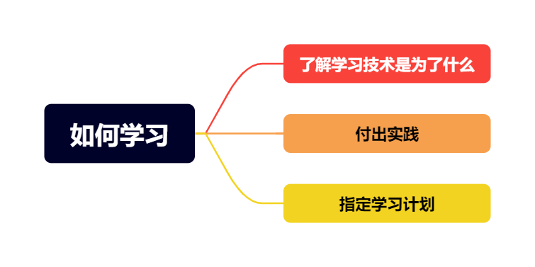
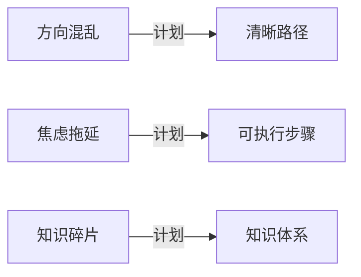

# 如何学习 📚

::: tip
学习是一件简单但需要坚持的事情。
:::

## 路线

## 了解学习技术是为了什么
✨ ​每当我们学习一门新的技术时先问​​: 需要清楚地了解这项技术的出现是为了解决旧技术的哪些不足或痛点。

✅ **example：**
- jQuery →  原生 JavaScript 操作 DOM 复杂、兼容性差的问题。
- React → jQuery 在构建复杂界面时代码混乱、状态管理困难的问题。
- TypeScript → JavaScript 类型不明确、易出错、难以维护的问题。
- Git → 解决团队协作代码版本冲突
- Docker → 解决环境配置不一致

::: danger 注意
不能为了学习技术而学习技术。要先明确技术是为了解决什么问题，再去学习，这样才能学得更有针对性和价值。
:::

## 制定学习计划
### 学习计划的价值

学习计划是为自己本身提供了明确的方向，避免努力错位，为达到目标提供了初始燃料

### 核心作用
::: tip
​​为大脑构建认知地图​​，避免陷入“学海无涯却无处靠岸”的困境
:::

## 付出实践
### 实践的价值
实践是为了将学习计划，想法最终落地。凭空想象并不能提供给你实际意义

### 知识理论 vs 实践对比实验
| 学习方式         | JavaScript 闭包掌握率（24小时后测试） |
|------------------|--------------------------------------|
| 听课 2 小时      | 12%                                 |
| 读文档 1.5 小时  | 9%                                  |
| 写代码 30 分钟   | 85%                                 |

::: tip
上方表格仅供参考,每个人学习效率不同,作者只想告诉你的是实践是知识落地的唯一路径​
:::

