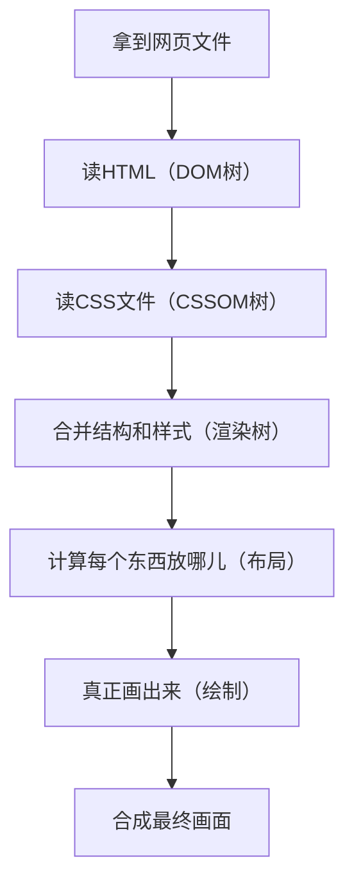

# HTML 知识进阶

> [!tip]
> 下方知识有些知识点不懂的，均做了解即可.

## title 与 h1 的区别、b 与 strong 的区别、i 与 em 的区别？

- strong 标签有语义，是起到加重语气的效果，而 b 标签是没有的，b 标签只是一个简单加粗标签。b 标签之间的字符都设为粗体，strong 标签加强字符的语气都是通过粗体来实现的，而搜索引擎更侧重 strong 标签。
- title 属性没有明确意义只表示是个标题，H1 则表示层次明确的标题，对页面信息的抓取有很大的影响
- i 内容展示为斜体，em 表示强调的文本

## 字符编码

### 1. 文字是如何存储到机器中的？

当我们在计算机上输入一个文字（比如字母、数字或者符号），计算机会通过 **字符编码** 将这个文字转换成机器能理解的二进制数据。这个过程就像是把我们平常看到的字母（比如 "A"）转换成计算机能够处理的数字。

例如，在 **ASCII** 编码中，字母 "A" 对应的数字是 **65**。计算机内部会将这个数字转换成二进制表示，例如：

- "A" -> ASCII 编码值 **65** -> 二进制 **01000001**

这个过程叫做 **编码**，即将文字转换为数字，计算机通过这些数字来存储和处理文字。

### 2. 计算机怎么从机器中读取并显示文字？

当计算机需要显示文字时，它会从内存或存储中读取这些二进制数据，然后使用 **字符编码表** 将数字转换回字符。例如，如果计算机读取到数字 **65**，它会查找字符编码表，发现 **65** 对应的是字母 **"A"**，然后将 **"A"** 显示在屏幕上。

### 3. 如果使用了不同的编码会发生什么？

假设我们在存储文本时使用了一种编码，而在读取时却用另一种编码来解码。这就会导致 **字符解码错误**，显示成乱码，原因是不同编码中的数字代表的字符不同。

#### 示例 1：存储时用 UTF-8，读取时用 ASCII

- 存储：我们输入一个中文字符 "我"，它在 UTF-8 编码下是多个字节存储的，例如：
  - "我" 的 UTF-8 编码是 **E6 88 91**（三个字节）。
- 读取：如果计算机以 **ASCII** 编码方式去读取这些字节，ASCII 只能处理 128 个字符（主要是英文和符号），它会把 **E6**、**88** 和 **91** 看作独立的字节，但 ASCII 表并没有定义这些字节对应的字符，于是会出现乱码。

比如，"我" 在 UTF-8 编码下被存储成 **E6 88 91**，但在 ASCII 解码时，这些字节会变成一些奇怪的符号，显示出来可能会是一些不可识别的乱码。

#### 示例 2：存储时用 UTF-16，读取时用 UTF-8

- 存储：如果我们存储一个字符 "A"，它在 **UTF-16** 编码下可能是 **00 41**（占用 2 字节）。
- 读取：但如果我们用 **UTF-8** 去解码这两个字节，它会把 **00 41** 解释成两个独立的字符，结果就不是 "A" 了，而是乱码。

### 4. 不同编码格式导致的乱码问题

每种编码方式（如 **UTF-8**、**ASCII**、**ISO-8859-1** 等）有自己的一套字符表。例如：

- 在 **UTF-8** 编码中，"A" 的编码是 **0x41**。
- 在 **ISO-8859-1** 编码中，"A" 也是 **0x41**。
- 但是，在 **UTF-16** 编码中，"A" 是 **0x0041**（占用 2 字节）。

如果你使用 **UTF-8** 编码存储数据，但以 **ISO-8859-1** 解码，就会导致字符不正确，因为同样的二进制数字会被解读为不同的字符，出现乱码。

### 5. 举个实际的例子

假设你存储了一个中文字符 "你"：

- 在 **UTF-8** 中，"你" 会被编码成 **E4 BD A0**（三个字节）。
- 如果你误用了 **ISO-8859-1** 来解码这三个字节，那么计算机会将每个字节 **E4**、**BD**、**A0** 看作独立的字符，而这些字节在 ISO-8859-1 中并没有对应的字符，最终显示出来的就会是乱码。

### 6. 乱码问题总结

当字符编码不匹配时，计算机就无法正确地解读数据，因为每个字符编码标准中的数字代表的字符不同。这会导致：

- **乱码显示**：字符无法正确显示，可能显示为问号、方框或奇怪的符号。
- **数据丢失**：错误的解码可能导致部分数据丢失，甚至完全无法恢复。
- **跨平台问题**：如果不同平台或不同系统使用不同的字符编码，也容易产生乱码问题，尤其是在多语言环境中。

### 7. 如何避免乱码？

1. **统一编码**：确保你在存储和读取时使用相同的字符编码，推荐使用 **UTF-8**，因为它支持全球各种语言，并且向后兼容 ASCII。
2. **在网页中设置编码**：在 HTML 中设置字符编码：
   ```html
   <meta charset="UTF-8" />
   数据库和文件编码一致：如果你使用数据库存储数据，确保数据库的字符编码与应用程序使用的字符编码一致，通常推荐使用
   UTF-8 编码。
   ```

避免手动转换编码：尽量避免手动转换字符编码，使用库或框架来自动处理编码和解码

### 8. 字符编码的常见标准

常见的字符编码标准包括：

1. **ASCII**：最初的编码方式，能表示 128 个字符，主要包括英文字母、数字和一些符号。由于它只支持英语，逐渐被其他编码标准所替代。

2. **ISO-8859-1**（Latin-1）：支持西欧语言，包括西班牙语、法语、德语等。它是一个 8 位的编码，能够表示 256 个字符。

3. **UTF-8**：目前最广泛使用的字符编码，支持全球各种语言，能够表示所有 Unicode 字符。它是一个变长编码，兼容 ASCII，因此对于英文文本的处理不会产生任何问题，同时它也能表示包括中文、日文、韩文等在内的多种语言字符。

4. **UTF-16**：支持 Unicode 字符集中的所有字符。与 UTF-8 不同，UTF-16 使用固定的 2 字节长度（对于大多数字符）或 4 字节长度（对于一些扩展字符）来表示字符。

5. **GB2312 / GBK / GB18030**：主要用于表示中文字符。GB2312 是最早的中文编码标准，GBK 和 GB18030 是其扩展，支持更多汉字和符号。

### 9. 编码与解码过程中的常见错误

编码和解码时可能会发生多种错误，常见的包括：

1. **字符丢失**：如果在编码过程中有字符没有被正确映射（例如，某些符号在某个编码中无法表示），这些字符可能会丢失或者替换为特殊字符（如问号或方框）。

2. **乱码**：当不同编码方式的字符被混合使用时，字符就会变成乱码，无法正确显示。这种情况通常发生在不同系统之间交换数据时。

3. **字节顺序错误**：某些编码（例如 UTF-16）可能会有字节顺序（byte order）的问题，这意味着字节的存储顺序需要特别注意。如果在解码时未正确处理字节顺序，可能会出现乱码或字符显示错误。

### 10. 编码转换的注意事项

在进行编码转换时，必须确保源编码和目标编码的匹配，避免字符丢失和乱码问题。常见的编码转换工具和库包括：

- **Python**：Python 的`encode()`和`decode()`方法可以用来进行字符编码转换，例如：
  ```python
  text = "你好"
  encoded_text = text.encode("utf-8")  # 将文本编码为UTF-8
  decoded_text = encoded_text.decode("utf-8")  # 从UTF-8解码回文本
  ```

## 浏览器的作用以及内核

浏览器的作用是负责将前端的文件进行一个解析和渲染网页内容，是用户与前端的桥梁

### 浏览器内核是什么？

浏览器内核（Rendering Engine）是浏览器的核心组件，主要负责网页的解析、渲染和交互。它包括两大部分：

- **渲染引擎（Rendering Engine）**：负责解析 HTML、CSS，生成页面内容并渲染到屏幕上。
- **JS 引擎（JavaScript Engine）**：负责解析和执行 JavaScript 脚本，实现网页的动态交互。

不同浏览器可能采用不同的内核，内核的不同会导致网页在不同浏览器下的表现略有差异。

### 主流浏览器内核对比表

下方是我从浏览器进行收集的引擎信息

| 浏览器                 | 渲染引擎（排版引擎） | JS 引擎          | 备注                      |
| ---------------------- | -------------------- | ---------------- | ------------------------- |
| Chrome                 | Blink                | V8               | Blink 基于 WebKit 分支    |
| Edge（新版）           | Blink                | V8               | Chromium 内核             |
| Edge（旧版）           | EdgeHTML             | Chakra           | 现已被新版 Edge 替代      |
| Safari                 | WebKit               | JavaScriptCore   | 苹果自研，iOS/iPadOS 专用 |
| Firefox                | Gecko                | SpiderMonkey     | 独立开发                  |
| Opera（新）            | Blink                | V8               | 早期用 Presto，现用 Blink |
| 360/QQ/UC 等国产浏览器 | Blink/WebKit/Trident | V8/JSCore/Chakra | 多内核，兼容模式切换      |
| Internet Explorer      | Trident              | Chakra           | 已停止维护                |

**说明：**

- Blink 是 Google 主导开发的渲染引擎，现已成为主流（Chrome、Edge、Opera 等）。
- WebKit 是 Safari 和早期 Chrome 的内核，iOS 上所有浏览器都必须用 WebKit。
- Gecko 是 Firefox 独有的内核。
- Trident 是 IE 的内核，已被淘汰。
- JS 引擎决定了 JavaScript 的执行效率和特性支持。

### 浏览器渲染基本流程

1. 拿到网页文件

浏览器先从服务器拿到网页的 HTML 文件。

2. 读网页内容，搭积木

浏览器像搭积木一样，把 HTML 里的标签变成一个个没有颜色的积木,然后组合成 “结构树”（DOM 树）。

3. 读样式，给积木上色
   浏览器再去读 CSS 文件，把每个积木（网页元素）该是什么颜色、大小、字体都记下来（CSSOM 树）。
4. 合并结构和样式，准备画画
   把结构[积木]和样式[颜色]合起来，决定哪些东西要显示、怎么显示（渲染树）。
5. 计算每个东西放哪儿
   浏览器算一算，每个元素应该放在页面的哪个位置、占多大地方（布局/回流）
6. 真正画出来
   浏览器把这些内容一块块画到屏幕上（绘制）。
7. 合成最终画面
   如果有动画、浮层等，浏览器会把不同的“画布”合成，最后显示给你看。

##### 流程图



## 元素的结构
元素


## `src` 和 `href` 的区别

| 属性   | 全称             | 作用                     | 用于标签示例                  | 加载行为        |
|--------|------------------|--------------------------|-------------------------------|-----------------|
| `src`  | source（来源）   | 嵌入资源（替换当前内容） | ``, `<script>`, `<iframe>` | **立即加载资源**，阻塞渲染（如 `<script>`） |
| `href` | hyper reference（超链接） | 指向资源地址（链接）         | `<a>`, `<link>`, `<area>`     | **导航或引用资源**，不会嵌入 |

---

### ✅ 简单理解：

- `src`：**告诉浏览器加载一个资源内容并嵌入到页面中**  
  - 示例：`` → 加载并显示图片  
  - 示例：`<script src="app.js">` → 加载并执行 JS 文件

- `href`：**告诉浏览器“链接到哪里”或“引用一个外部文件”**  
  - 示例：`<a href="https://example.com">跳转</a>` → 点击跳转  
  - 示例：`<link href="style.css" rel="stylesheet">` → 引入 CSS

---

### ⚠️ 提醒：
- `src` 会将目标文件的内容**嵌入并执行**；
- `href` 是**超链接引用**，可用于跳转或关联外部资源。


## 块元素 和 行元素

## SEO
**SEO** 是“搜索引擎优化”的英文缩写，意思是：  
通过一些方法，让你的网站更容易被百度、Google 这样的搜索引擎找到，从而获得更多访问量。

### 📌 SEO 的主要目的：

- 让网站在搜索结果中排在更前面
- 吸引更多人点击访问（不用花广告费）
- 提升网站的可信度和曝光度

### 🔧 常见的 SEO 优化方法：

1. **使用合理的 HTML 标签**
   - 比如用 `<header>` 表示头部、`<article>` 表示文章内容等
   - 用 `<h1>` ~ `<h6>` 给内容加标题，让搜索引擎知道内容结构

2. **写好网页的 Meta 信息**
   - 这些信息不会直接显示在页面上，但搜索引擎会读取它们
   - 比如：
     ```html
     <meta name="description" content="一个简单易懂的前端学习网站">
     <meta name="keywords" content="HTML, CSS, JavaScript, 前端, 教程">
     ```

3. **网址要简洁**
   - 比如：`/html/tags` 比 `/index.php?page=123` 更容易被记住和收录

4. **关键词要合适**
   - 让网页内容里自然地包含用户可能搜索的词
   - 不要堆砌关键词，要自然、有用

5. **结构清晰的网站**
   - 网站的目录、导航要清楚，像一本目录分明的书
   - 提供 sitemap（网站地图）让搜索引擎更容易抓取页面

6. **页面加载快、适合手机**
   - 页面打开越快，用户体验越好
   - 手机上访问也要正常显示，叫“响应式设计”

7. **适当使用内链和外链**
   - 页面之间有互相连接（内链）
   - 有别的网站愿意链接到你（外链），可以提升权重

### 原理


## 元素语义化
**用元素做正确的事情。**

使用有意义的 HTML 标签来表达结构和内容，让浏览器、搜索引擎和开发者更容易理解页面。

- 例子：
  - 使用 `<header>` 表示页面头部
  - 使用 `<article>` 表示一篇文章
  - 使用 `<strong>` 表示重要内容，而不是单纯加粗

---

## iframe
用于在当前页面中嵌入另一个网页。

- 例子：
  ```html
  <iframe src="https://example.com" width="600" height="400"></iframe>

  ```

## DOCTYPE(⽂档类型) 的作⽤
告诉浏览器用哪种 HTML 规范来解析页面。
最常见写法：
```
<!DOCTYPE html>
```
表示使用 HTML5 标准，避免浏览器进入“怪异模式（Quirks Mode）”。


## URL 和 URI

## meta
提供网页的元信息，帮助浏览器和搜索引擎理解页面。

常用示例：

```
<meta charset="UTF-8">
<meta name="viewport" content="width=device-width, initial-scale=1.0">
<meta name="description" content="一个学习前端的入门网站
```


## chrome 调试
按 F12 或右键“检查”打开，常用功能有：

- Elements：查看/修改 HTML 和 CSS

- Console：查看输出、调试 JS

- Network：查看资源加载情况（速度、失败）

- Sources：调试 JavaScript 代码（打断点）

- Performance：分析页面性能瓶颈

- Lighthouse：网站 SEO、性能评分建议