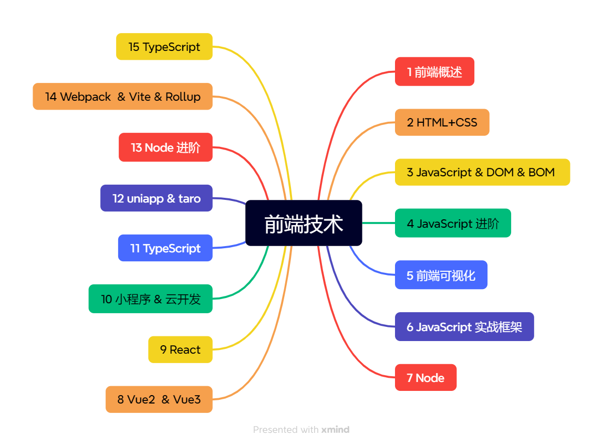

# 前端概述 💻
## 学习路线

## 前端发展 🚀
- 从静态网页到动态交互：经历了 HTML、CSS、JavaScript 的基础阶段，到 Ajax、jQuery 的动态网页，再到现代前端框架的兴起。
- 移动端与响应式：随着移动互联网的发展，响应式设计和移动端适配成为主流。
- 前后端分离：RESTful API、GraphQL 等推动了前后端分离架构，提升了开发效率和协作体验。
- 工程化与自动化：Webpack、Vite 等构建工具普及，前端开发流程更加自动化、模块化。
- 生态繁荣：NPM、开源社区推动了前端技术的快速演进和丰富的生态系统。

## 技术角度  🛠️

### 框架
- React
- Vue
- Angular
- Svelte

### 工具

- Webpack / Vite
- Babel
- ESLint / Prettier
- PostCSS / Sass / Less

### 模式
- 组件化开发
- 单页应用（SPA）
- 服务端渲染（SSR）
- 微前端

## 程序员发展路线 🌱

```mermaid
flowchart LR
    A(开始) --> B(喜欢编程的)
    B --> C(打工仔)
    C --> D(程序小白)
    D --> E(初级程序员)
    E --> F(中级程序员)
    F --> G(高级程序员)
    G --> H(走管理路线)
    G --> I(走技术路线)
    H --> J(项目经理)
    H --> K(研发总监)
    H --> L(CEO)
    I --> M(架构师/系统分析师)
    I --> N(技术总监CTO)
    N --> O(IT培训讲师)
    N --> P(资深技术专家)
    M --> Q(IT讲师/讲师)
    E --> R(迷茫不爱做程序员)
    B --> S(凑数做的)
    S --> R

    %% 路线标记
    classDef route1 fill:#f99,stroke:#333,stroke-width:2px;
    classDef route2 fill:#ccc,stroke:#333,stroke-width:2px;
    classDef route3 fill:#f9f,stroke:#333,stroke-width:2px;
    classDef route4 fill:#ff9,stroke:#333,stroke-width:2px;
    classDef route5 fill:#9cf,stroke:#333,stroke-width:2px;
    classDef route6 fill:#9f9,stroke:#333,stroke-width:2px;
```

## 技术发展路线 🌱
```mermaid
flowchart TD
    A(初级程序员<br/>薪资6k-10k，1~2年) --> B(中级程序员<br/>薪资10k-20k，2~4年)
    B --> C(高级程序员<br/>薪资20k-50k，4~6年)

    A --> A1(负责简单业务<br/>承担模块开发、维护)
    A --> A2(遇到问题需查资料和请教交流)
    A --> A3(代码规范有待提升，能用就行)

    B --> B1(可独立负责小型项目<br/>核心业务开发、维护)
    B --> B2(遇到多数问题可自行查阅解决<br/>有自学能力)
    B --> B3(代码质量较高，遵守规范<br/>对组内其他人的代码有要求)

    C --> C1(独立负责中大型项目<br/>可搭建架构，创造内部的脚手架)
    C --> C2(可训练新同事，带团队<br/>主导高质量代码设计、架构、思想)
    C --> C3(具备高执行力和责任心<br/>成为公司技术不可或缺的一部分)
```

## 如何实现个人成长 🌟
> - 个人成长比公司成长更加重要
> - 避免 996 消耗太多个人成长的时间
> - 考虑公司是否能给你带来成长
> - 永远保持学习的心态

## 如何技术成长 📚
- 阅读官方文档
- 阅读Book
- 阅读源码
- 阅读开源项目

