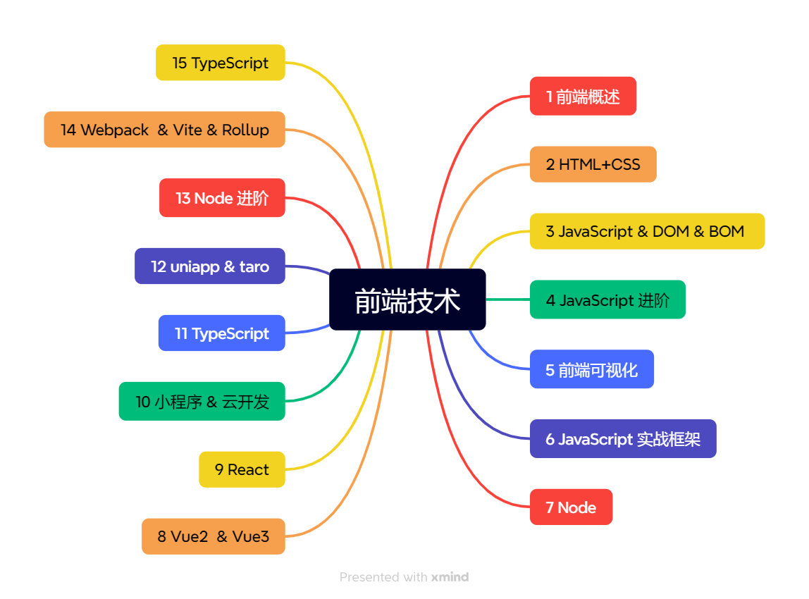
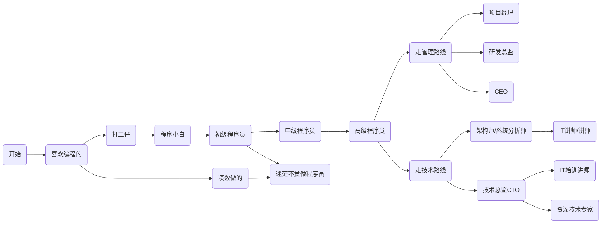
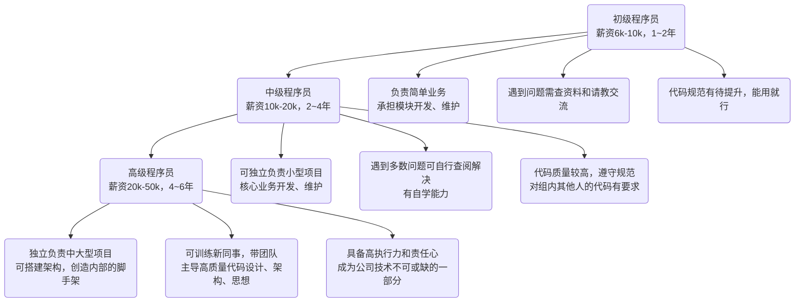

# 前端概述 💻
## 学习路线

## 前端发展 🚀
- 从静态网页到动态交互：经历了 HTML、CSS、JavaScript 的基础阶段，到 Ajax、jQuery 的动态网页，再到现代前端框架的兴起。
- 移动端与响应式：随着移动互联网的发展，响应式设计和移动端适配成为主流。
- 前后端分离：RESTful API、GraphQL 等推动了前后端分离架构，提升了开发效率和协作体验。
- 工程化与自动化：Webpack、Vite 等构建工具普及，前端开发流程更加自动化、模块化。
- 生态繁荣：NPM、开源社区推动了前端技术的快速演进和丰富的生态系统。

## 技术角度  🛠️

### 框架
- React
- Vue
- Angular
- Svelte

### 工具

- Webpack / Vite
- Babel
- ESLint / Prettier
- PostCSS / Sass / Less

### 模式
- 组件化开发
- 单页应用（SPA）
- 服务端渲染（SSR）
- 微前端

## 程序员发展路线 🌱

## 技术发展路线 🌱

## 如何实现个人成长 🌟
> - 个人成长比公司成长更加重要
> - 避免 996 消耗太多个人成长的时间
> - 考虑公司是否能给你带来成长
> - 永远保持学习的心态

## 如何技术成长 📚
- 阅读官方文档
- 阅读Book
- 阅读源码
- 阅读开源项目

