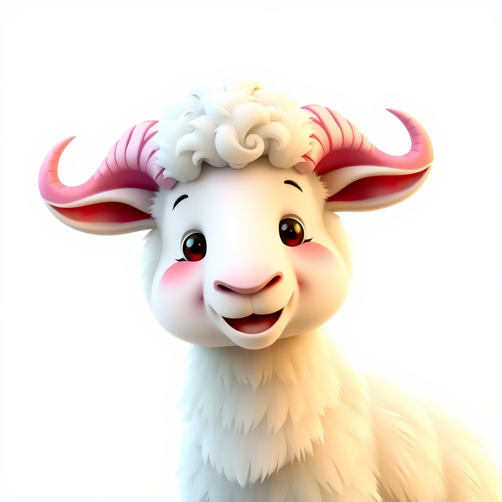

  

    

      
    

  

  

    <h1>技术学习文档</h1>
    

      Html, CSS, JavaScript, 后端：Java, Python, Go 等各类技术栈文档
    

    
汇集前沿技术知识，助力开发者快速成长

  

  
  

    <a href="/about" class="docs-btn docs-about-btn">关于我</a>
    <a href="/getting-started" class="docs-btn docs-learn-btn">开始学习</a>
  

