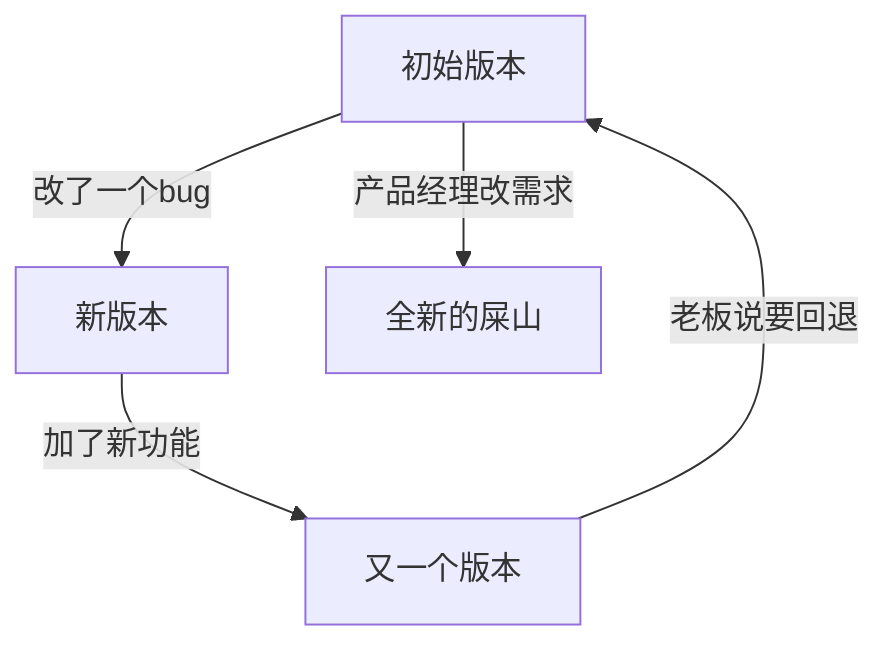
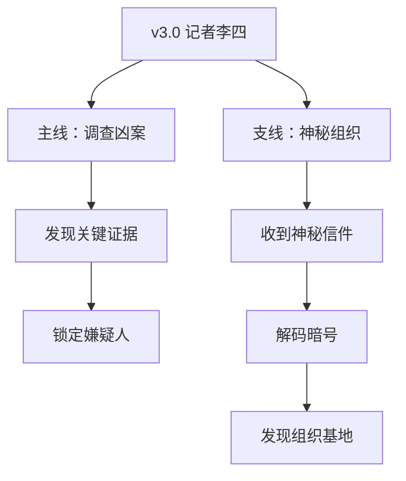
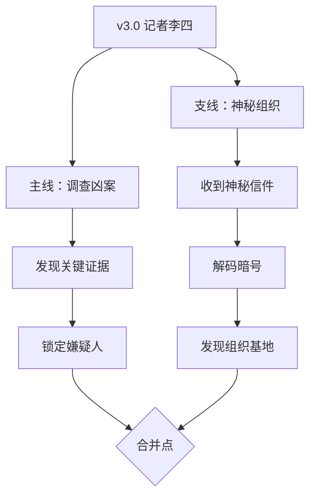
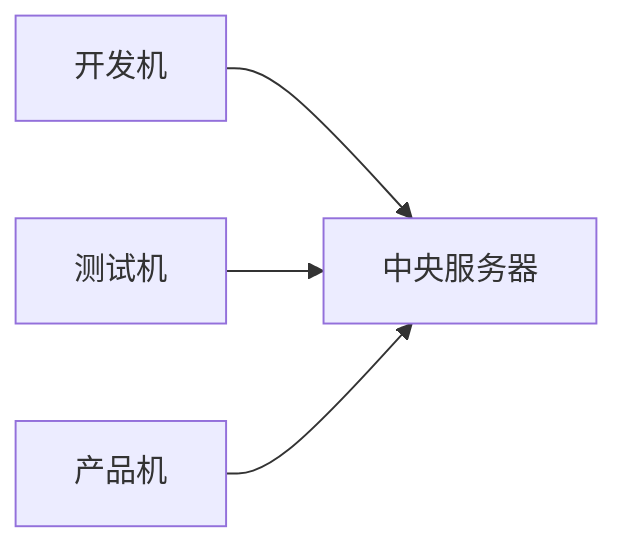
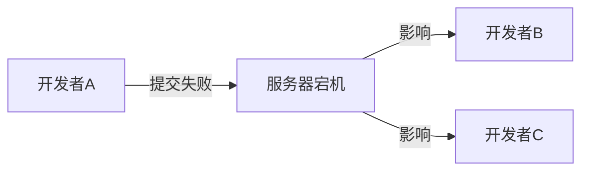
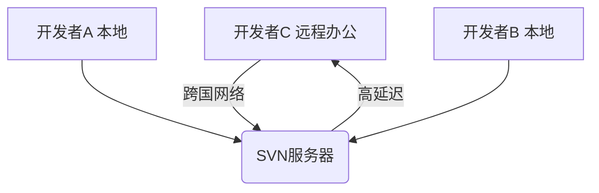
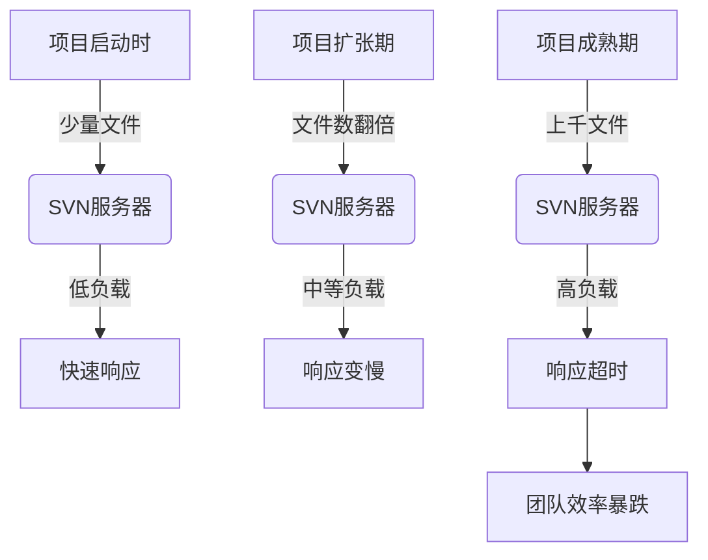
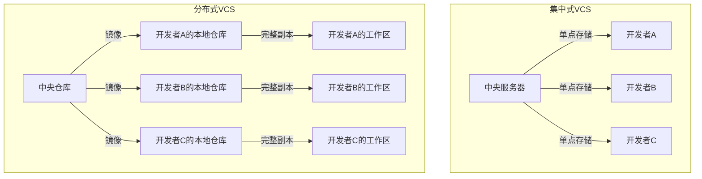

# Git

Git 作为事故率最高的工具,版本控制可谓是在开发领域大杀四方,不少小白在这踩过了坑,有合并错误代码,有合并脏东西的,有代码丢失,有离职同事的垃圾代码借尸还魂等等。本文档从头到尾和你讲清楚 Git 到底在解决什么问题,如何让你头光亮光亮的

# 版本控制基本概念

## 何为版本

版本这词在软件行业非常的常见,例如

- window 2008,window 10 window 11...
- iphone 8,iphone 11,iphone 12,iphone 13....
  ::: warning
  可是版本仅仅是数字上的迭代吗？那你想的可能过于简单了
  :::

` 程序员眼中的版本​​：`



所谓的版本本质上其实是旧事物到新事物的一个变化单位

## 何为控制

那么何为控制呢？控制要解决的其实是版本在迭代过程中,对版本的进行回退,合并等操作,我们举一个简单的例子

### 📝 小说创作中的版本控制

假设你是一位作家，正在创作一部小说：

**版本演变：**

​​v1.0​​：主角叫张三，是位侦探

```code
第一章：雨夜凶案
张三站在案发现场，雨水打湿了他的风衣...
```

​​v2.0​​：改名李四（主角改名）

```
第一章：雨夜凶案
李四站在案发现场，雨水打湿了他的风衣...
```

​​v3.0​​：改变职业（侦探 → 记者）

```
第一章：雨夜凶案
记者李四站在案发现场，雨水打湿了他的西装...
```

::: tip 注意
v2.0 和 v3.0 差别在于李四穿的衣服时对应任务的职位
:::

​​v4.0​​：添加新角色

```
第一章：雨夜凶案
记者李四站在案发现场，雨水打湿了他的西装。
突然，一个神秘女子出现在巷口...
```

### 那么我希望我有以下操作能对版本进行控制

#### 回退（时光倒流）

突然有一天,我觉得 v4.0 的新角色破坏了故事主线：
就像撕掉最新写的几页纸，回到之前的剧情

#### 分支（平行宇宙）

可能我的故事需要分开两个剧情编写,比如



#### 合并（剧情融合）

站在剧情角度上,上方的剧情收尾时，我需要回到主线



#### 差异比较（找不同）

站在作者的角度上，当我有一天我的剧情写的很多很多时，我希望能够对剧情进行一个比较看是否整个剧情是否通顺,我可能需要拿到不同版本的剧本进行比较

```
- 张三站在案发现场，雨水打湿了他的风衣
+ 记者李四站在案发现场，雨水打湿了他的西装
```

::: tip
这就是版本控制中的控制含义。
:::

# VCS 又是什么

版本控制系统（Version Control System，VCS） 是一种实现版本控制的软件工具,它能够帮助开发人员以代码为单位进行团队协同工作,并存档他们工作的完整历史记录。

## VCS 进化史：从石器时代到 Git 时代

中央集权时代（SVN 为代表）,最初的版本控制系统。



我们举一个例子,来讲讲这个中央集权模型有什么缺点,为什么后面慢慢走下坡路了

#### 单点故障

场景景描述 ​​：
假设某周五下午，三人正在紧急修复一个线上 bug，需在当天发布一个修复版本。

- 16:00：开发者 A 👨‍💻 提交了修复代码的一部分。

- 16:10：服务器机房空调故障，SVN 服务器宕机。
  ​​ 后果 ​​：

- 开发者 B 👩‍💻 完成代码后无法提交（报错："无法连接服务器"）

- 开发者 C 🧑‍💻 需要开发者 A 刚提交的代码才能继续，但无法获取更新

- 所有开发者失去版本控制能力：



团队陷入瘫痪，无法协同工作，最终错过发布时间。
​​ 现实类比 ​​：银行的核心系统宕机后，所有 ATM、柜台业务全部停摆。当然这里只是举一个例子

#### 网络延迟



#### 项目变大,服务器压力过大



## 分布式 VCS 革命（Git 为代表）

分布式 VCS 和中央式的区别在于，分布式 VCS 除了中央仓库之外，还有本地仓库：团队中每一个成员的机器上都有一份本地仓库，这个仓库里包含了所有的版本历史，每个人在自己的机器上就可以提交代码、查看历史，而无需联网和中央仓库交互——当然，取而代之的，你需要和本地仓库交互。

### 分布式模型与集中式模型


