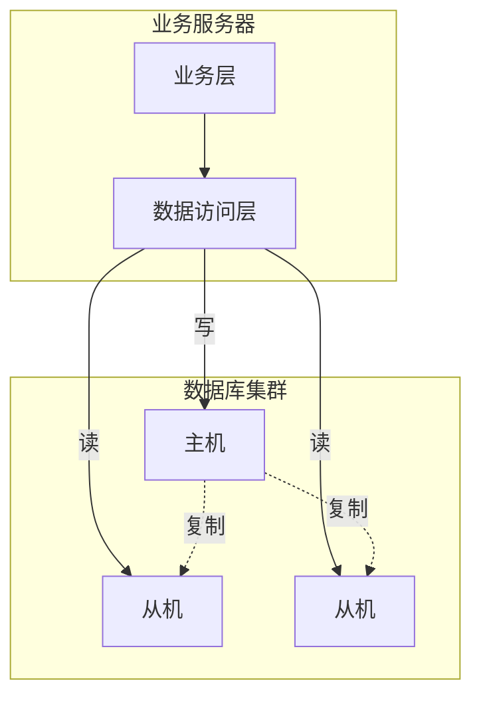
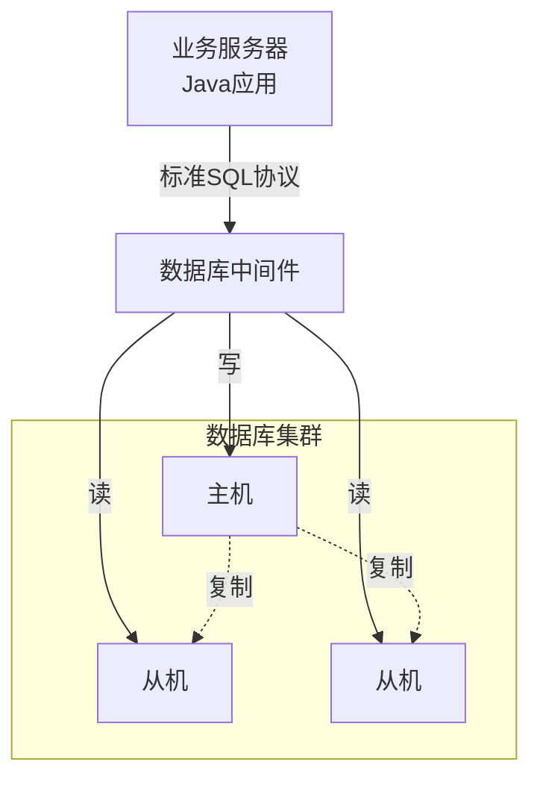

# 目录

## 实现方式
读写分离和数据分片具体的实现方式: `程序代码封装` 和 `中间件`

## 程序代码封装
程序代码封装指的是在代码中抽象一个`数据访问层`. 实现读写分离和数据库服务器连接管理

## 中间件
所谓的中间件指的是独立一套单独的系统，实现读写分离和数据库连接的管理。

## 常见中间件
- **ShardingSphere**  
  开源、功能强大，支持分库分表、读写分离、分布式事务等，兼容多种数据库。

- **MyCat**  
  国人开发的开源数据库中间件，支持分库分表、读写分离，适合中小型项目。

- **Cobar**  
  阿里巴巴开源的数据库中间件，适合MySQL分库分表场景。

  - **TDDL**  
  淘宝分布式数据层，主要用于阿里内部。

- **Vitess**  
  YouTube开源，适合大规模MySQL集群的分片和管理
