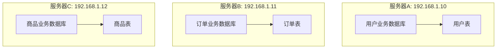
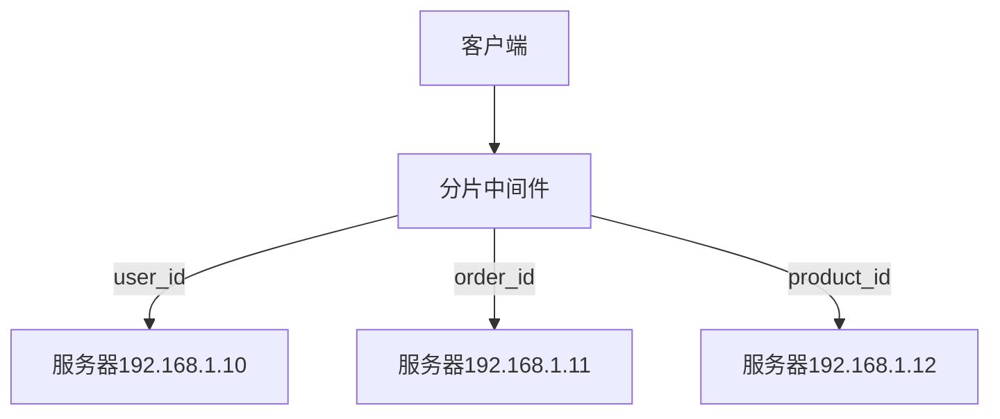
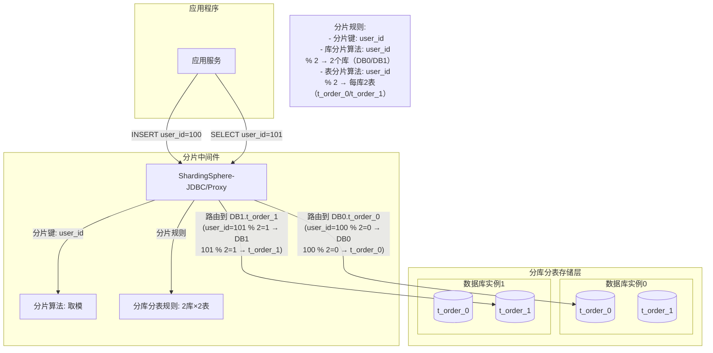

# 🗂️ 数据分片概念

<!-- TOC -->

- [🗂️ 数据分片概念](#-%E6%95%B0%E6%8D%AE%E5%88%86%E7%89%87%E6%A6%82%E5%BF%B5)
    - [什么是数据分片](#%E4%BB%80%E4%B9%88%E6%98%AF%E6%95%B0%E6%8D%AE%E5%88%86%E7%89%87)
    - [分片对象](#%E5%88%86%E7%89%87%E5%AF%B9%E8%B1%A1)
    - [数据拆分方式](#%E6%95%B0%E6%8D%AE%E6%8B%86%E5%88%86%E6%96%B9%E5%BC%8F)
    - [垂直分片](#%E5%9E%82%E7%9B%B4%E5%88%86%E7%89%87)
        - [垂直分库](#%E5%9E%82%E7%9B%B4%E5%88%86%E5%BA%93)
    - [垂直分表](#%E5%9E%82%E7%9B%B4%E5%88%86%E8%A1%A8)
        - [垂直分表](#%E5%9E%82%E7%9B%B4%E5%88%86%E8%A1%A8)
        - [水平分表](#%E6%B0%B4%E5%B9%B3%E5%88%86%E8%A1%A8)
        - [数据分片算法](#%E6%95%B0%E6%8D%AE%E5%88%86%E7%89%87%E7%AE%97%E6%B3%95)
    - [整体流程](#%E6%95%B4%E4%BD%93%E6%B5%81%E7%A8%8B)

<!-- /TOC -->
- 水平拆分

## 垂直分片
### 垂直分库
按照业务拆分的方式叫做垂直拆分，用叫做纵向拆分。在拆分之前，对数据表进行业务划分，某一类的数据表汇总到某一类数据库。最终将数据库部署到不同的机器

那么查询的时候，通过分片的中间件路由到不同的服务器，这样达到了垂直拆分的应用

> 但是不能解决单表数据量过大的场景，只能解决如下
>
> - **访问单库压力**
> - **单库数据量压力**

## 垂直分表

### 垂直分表
垂直分表适合将表中某些不常用的列，或者占用了大量空间的列拆分出去

假设我们是一个电商网站，用户在浏览商品列表时，主要只需要展示商品的名称（name）、价格（price）和主图（main_image），而商品的详细描述（description）和用户评论（comments）字段内容较多且一般只在商品详情页才会用到。因此，我们可以将 description 和 comments 字段单独拆分到另一张表中。这样在查询商品列表时，只需访问主表，能显著提升查询性能。

垂直分表带来的复杂性主要体现在操作次数的增加。例如，原来只需一次查询就能获取 name、price、main_image、description、comments，现在需要两次查询：一次查询 name、price、main_image，另一次查询 description、comments。

### 水平分表
字段，例如id，或者多个id，根据某种规则分散至多个数据表中。每个分片包含一部分数据，当要查询的时候，根据某种规则再找回来。

  

### 数据分片算法

## 整体流程

